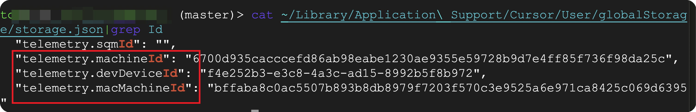

# Cursor Reset Tool

A utility tool that helps manage Cursor editor's device identification system by resetting stored device IDs. This can help Mac users to resolve issues related to account restrictions when switching between accounts or during trial periods.

## How It Works

The tool generates a new device identifier, which allows Cursor to recognize your system as a new device.



## Key Features

- ✨ Automatic random device ID generation
- 🔄 Automatic backup of original configuration
- 📦 Zero dependencies - runs with built-in Python only.

## Installation & Usage

1. Download the script file:
   - Get `cursor.py` from this repository

2. Execute the script:
   ```bash
   ./cursor.py
   ```
   This will generate a new random device ID automatically.

**Important**: Before running the script, completely close Cursor. If Cursor runs in the background, it may override the new device ID.

## Configuration Location

The default configuration file is located at:
```
~/Library/Application Support/Cursor/User/globalStorage/storage.json
```

## Important Notice

This tool is developed for research and educational purposes only. Please use responsibly. The developer assumes no liability for any issues that may arise from using this tool.
